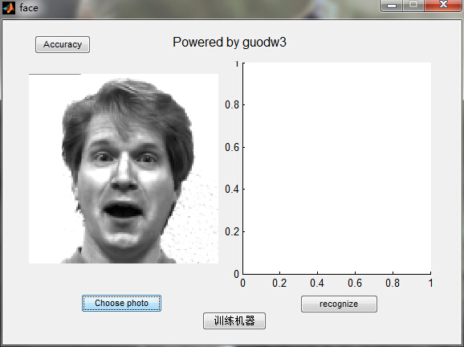
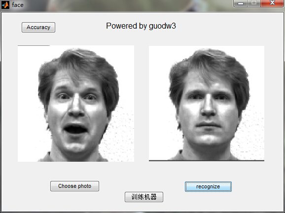
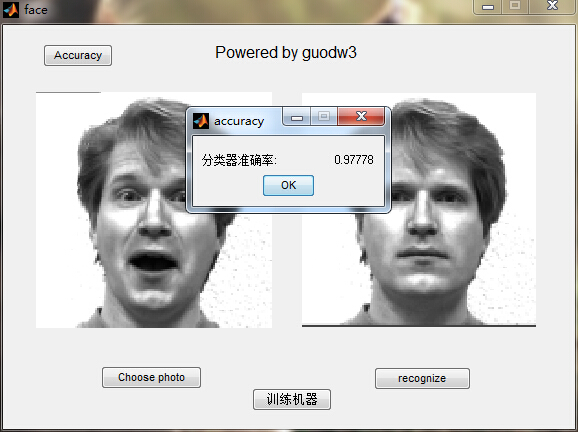

## 人脸识别GUI设计

这是我在理解PCA算法后，设计`MATLAB GUI`实现人脸识别。

### 使用方法：

1. 运行face.m主脚本
2. 点击`训练机器`选择train文件夹
3. 点击`choose photo`选择test文件夹下的一张图片
4. 最后点击`recognize`即可进行识别
5. 点击`Accuracy`可计算整个test文件夹下所有图识别准确率

### 效果如下：

